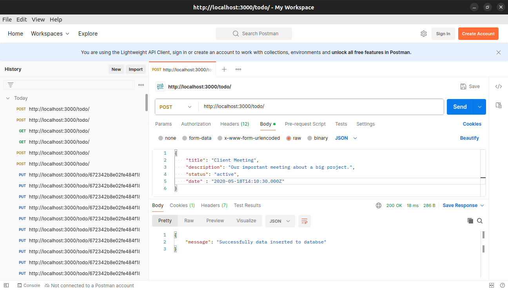
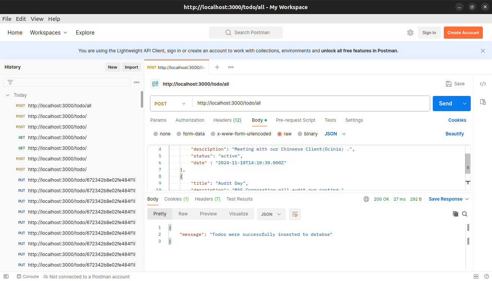
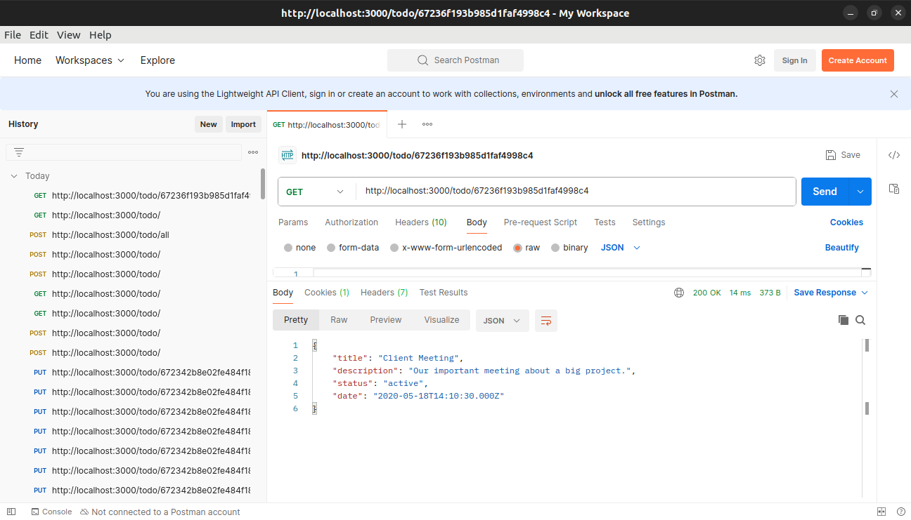
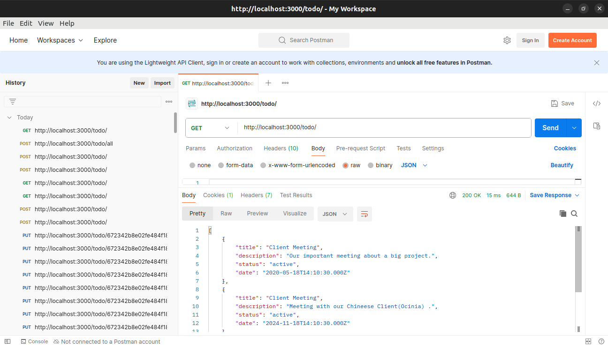
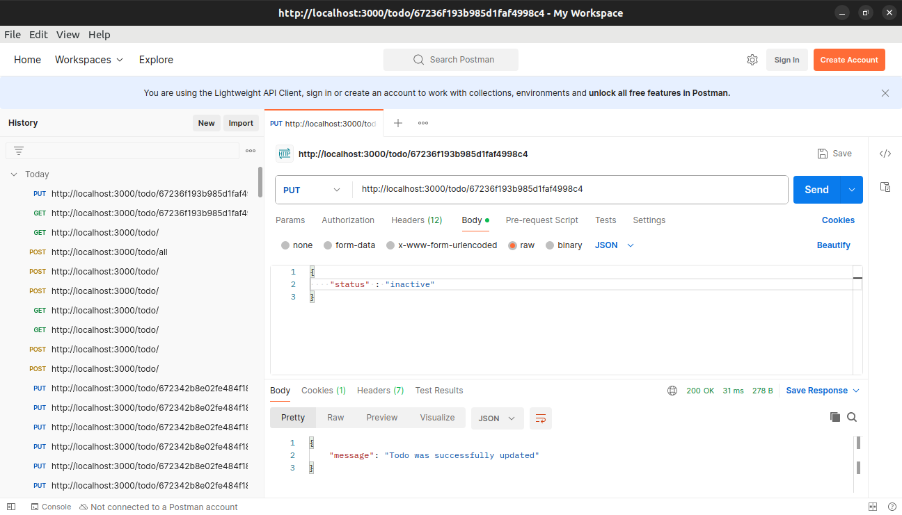
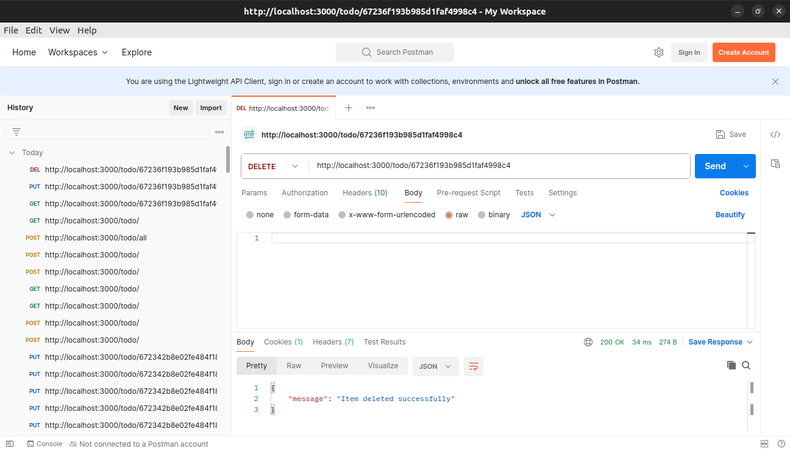
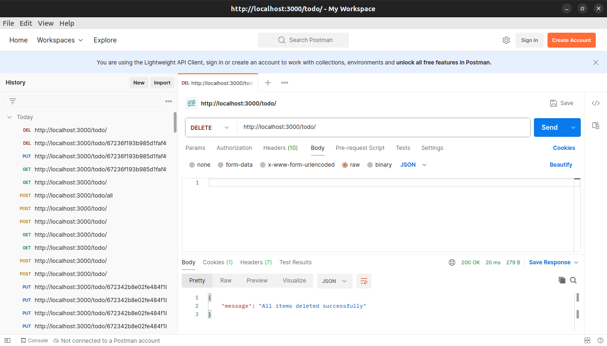

This is a TODO Application using expressJS and mongoDB.
User Libraries and frameworks:
  1. ExpressJS
  2. Express Router
  3. MongoDB
  4. Mongoose
  5. Mongoose Scheema

What we can do through requests:
  1. PostOne: to post only one todo to databse
  2. PostMany: to post more than one todos to database
  3. GetOne: to get only one todo by id (default ID that provide by mongoDB after insert)
  4. GetMany: to get all the todos from database
  5. Update: to update any info of todo by ID
  6. deleteOne: to delete a todo by ID
  7. deleteMany: to delete all todos from database

Request's Descriptions:
  1. postOne: In this case we can post a request by only using this URL: http://localhost:3000/todo/ on POST method
     and in request body we will provide our todo in that structure
     {
        "title" : "TODO title",
         "description" : "TODO Description",
         "status" : "active / inactive",
         "date" : "YYYY-mm-ddTHH:MM:ss"
     }
     
3. postMany: our url will be http://localhost:3000/todo/all and method will be POST
   and our request body will follow this structure:
   [
      {
        "title" : "TODO title",
         "description" : "TODO Description",
         "status" : "active / inactive",
         "date" : "YYYY-mm-ddTHH:MM:ss"
     },
     {
        "title" : "TODO title",
         "description" : "TODO Description",
         "status" : "active / inactive",
         "date" : "YYYY-mm-ddTHH:MM:ss"
     }
   ]
   
   3. getOne: In this case we will request GET method through this link: http://localhost:3000/todo/********** {* is id} 
   4. getAll: Here we will send GET request to http://localhost:3000/todo 
   5. update: Here we will send PUT request to http://localhost:3000/todo/********** {* is id} this link with updated data as body. 
   6. deleteOne: In this case we will request DELETE method through this link: http://localhost:3000/todo/********** {* is id} 
   7. deleteMany: Here we will send DELETE request to http://localhost:3000/ to delete all todos from database. 
